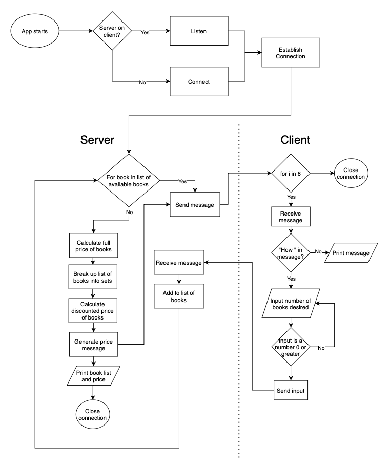

# Wizarding Books

I will be writing an algorithm to enable a user to purchase a number of books from the Wizarding Series, and the discounted price displayed to the buyer.

I will be basing this algorithm on the algorithm written for the workbook assignment earlier in the term, with the major difference that it will be used over a network, rather than on a single computer.

## Classes and Functions

The classes and their functions will be as follows:

### Client
A class to be used by the client, the computer being used to purchase the books.

#### \_\_init__
Upon initialisation, the instance will be given server, port, and client_socket values. It will then connect to a listening server.

#### buy_books
A for loop set to run six times, this method will receive a message from the server. If the message has "How " in it, I know this message will be requesting from the buyer how many of a particular book the person wishes to buy, so an input will be requested, with error handling built in.

Once an appropriate response has been received, the message will be sent back to the server.

All other messages received will simply be displayed.

#### close_client
A method to close the connection to the server.

### Server
A class to be used by the server, the computer being used to sell the books.

#### \_\_init__
Upon initialisation, the instance will be given server, port, and server_socket values. It will then bind to listen for connections, with socket error handling.

#### server_listen
A method to listen for connections from a client.

#### connect_server
A method to accept the connection request from the client.

#### close_server
A method to close the connection to the client.

#### sell_books
A method to sell books to the client (buyer). Sending messages and waiting for a response from the client, once all responses have been received, the cost of the books is displayed to both the client and server.

### Shopping_List
A class to ask the customer what they would like to buy.

#### \_\_init__
Upon initialisation, the instance will be given a shopping_list value, consisting of an empty list, a welcome message value and a books value, consisting of a list of books available to purchase.

#### get_list
A method to get inputs from the customer declaring how many copies of each book they wish to buy. Iterating through the list of books, a message is sent over the client_socket, with the response received used to add that particular number of books to the shopping list.

#### no_discount
A method to calculate the total cost of the books with no discounts applied.

#### sets_of_books
A method to break up the list of books into sub-lists, with each sub-list consisting of a set of unique books.

#### discounted_price
A method to calculate the total cost of the books with discounts applied.

#### print_price
A method to display the cost of the books, any discounts applied, and a few Harry Potter references.

## Dependencies
* socket[^1]: A Python standard library, this was imported into the Classes file to enable their connection to a network.
* sys[^2]: A Python standard library, this was imported into the Server and Client files. In testing, the program occasionally could not connect via the ports assigned to them, as they were still occupied by the previous test run. This enabled the files to be opened with an argument given in the terminal specifying a different port to use.

## Control Flow Diagram

## References

[^1]: “Socket — Low-Level Networking Interface — Python 3.9.7 Documentation.” Python, 2 Oct. 2021, docs.python.org/3/library/socket.html.

[^2]: “Sys — System-Specific Parameters and Functions — Python 3.9.7 Documentation.” Python, 2 Oct. 2021, docs.python.org/3/library/sys.html.