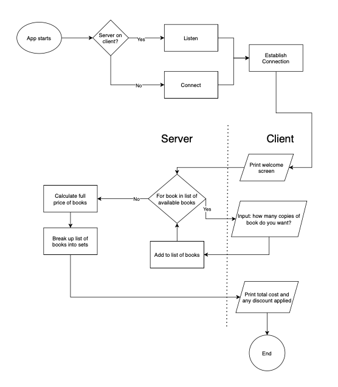

# Snowman

I will be writing an algorithm to enable a user to purchase a number of books from the Wizarding Series, and the discounted price displayed to the buyer.

I will be basing this algorithm on the algorithm written for the workbook assignment earlier in the term, with the major difference that it will be used over a network, rather than on a single computer.

## Classes

The classes & sub classes will be:
* Shopping_List - A class to ask the customer what they would like to buy
* Sets_of_Books - A class to determine how many sets of books are being purchased
* Calc_No_Discount - A class to calculate the cost of all the books at full price.
* With_Discount - A class to calculate the cost of all the books with any discount(s) applied.
* Print_Price - A class to print the price of the customer's purchase and any discount applied.

## Control Flow Diagram

