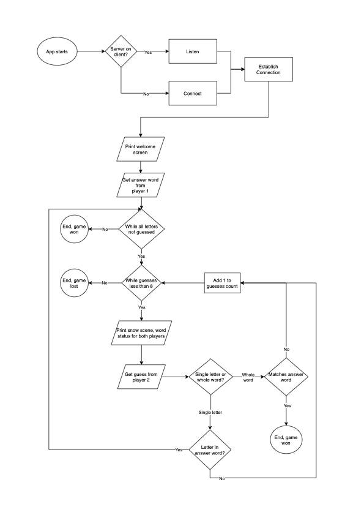

# Snowman

I will be writing an algorithm to enable two people to be able to play a game of Snowman, which I created last term but will be modifying.

I will need to create a server which allows 2 clients to connect to it, and the clients. The game itself will run on the server. The server will push to the client the current state of play to print on the screen. It will take inputs from the clients in the form of a word to guess from Player 1, and word or letter guesses from Player 2.

## Classes

The classes & sub classes will be:
* Game - held on the server, organises the communication between itself and the two clients.
* Snowscene - will take as an input the number of melts in the game for initialisation. The repr will display ASCII art to illustrate the current melt status.
* Player - 2 players on different clients.
    * Challenger - A.K.A. Player 1. At initialisation the player will have to provide for Player 2 to guess. A function will ensure the word is allowable, in that it only contains letters and is at least two letters long.
    * Guesser - A.K.A. Player 2. At initialisation will have to provide a letter or word guess. A function will ensure the guess is allowable, and is either one letter long or equal in length to the word to be guessed.

## Control Flow Diagram

